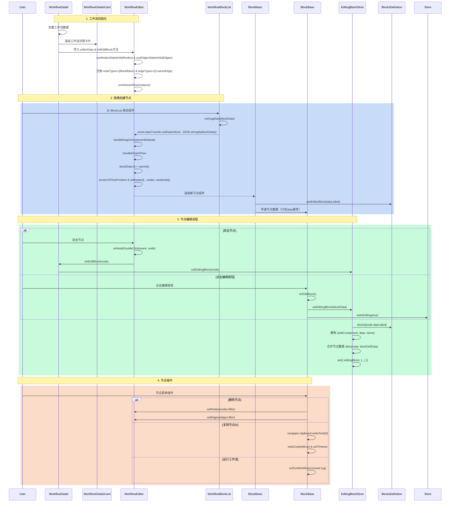

```mermaid
sequenceDiagram
    participant User
    participant WD as WorkflowDetail
    participant WDC as WorkflowDetailsCard
    participant WE as WorkflowEditor
    participant WBL as WorkflowBlockList
    participant BB as BlockBasic
    participant BBase as BlockBase
    participant EBS as EditingBlockStore
    participant Blocks as BlocksDefinition

    Note over WD,WE: 1. 工作流初始化
    WD->>WD: 加载工作流数据
    WD->>WDC: 渲染工作流详情卡片
    WD->>WE: 传入 editorData & initEditBlock方法
    WE->>WE: useNodesState(initialNodes) & useEdgesState(initialEdges)
    WE->>WE: 注册 nodeTypes={BlockBasic} & edgeTypes={CustomEdge}
    WE->>WE: onInit(reactFlowInstance)

    Note over User,WBL: 2. 拖拽创建节点
    rect rgb(200, 220, 250)
        User->>WBL: 从 BlockList 拖动组件
        WBL->>WBL: onDragStart(blockData)
        WBL-->>WE: event.dataTransfer.setData('block', JSON.stringify(blockData))
        WE->>WE: handleDragOver(preventDefault)
        WE->>WE: handleDropInFlow
        WE->>WE: blockData.id = nanoid()
        WE->>WE: screenToFlowPosition & setNodes([...nodes, newNode])
        WE-->>BB: 渲染新节点组件
        BB->>Blocks: useEditorBlock(data.label)
        BB->>BBase: 传递节点数据（只含data属性）
    end

    Note over User,EBS: 3. 节点编辑流程
    rect rgb(200, 250, 220)
        alt 双击节点
            User->>WE: 双击节点
            WE->>WE: onNodeDoubleClick(event, node)
            WE->>WD: initEditBlock(node)
            WD->>EBS: setEditingBlock(node)
        else 点击编辑按钮
            User->>BBase: 点击编辑按钮
            BBase->>BBase: onEditBlock()
            BBase->>EBS: setEditingBlock(blockData)
            BBase->>Store: setIsEditing(true)
        end
        EBS->>Blocks: blocks[node.data.label]
        EBS->>EBS: 解构 {editComponent, data, name}
        EBS->>EBS: 合并节点数据 defu(node, blockDefData)
        EBS->>EBS: set({ editingBlock: {...} })
    end

    Note over User,BBase: 4. 节点操作
    rect rgb(250, 220, 200)
        User->>BBase: 节点菜单操作
        alt 删除节点
            BBase->>WE: setNodes(nodes.filter)
            BBase->>WE: setEdges(edges.filter)
        else 复制节点ID
            BBase->>BBase: navigator.clipboard.writeText(id)
            BBase->>BBase: setIsCopied(true) & setTimeout
        else 运行工作流
            BBase->>BBase: onRunWorkflow(console.log)
        end
    end
```