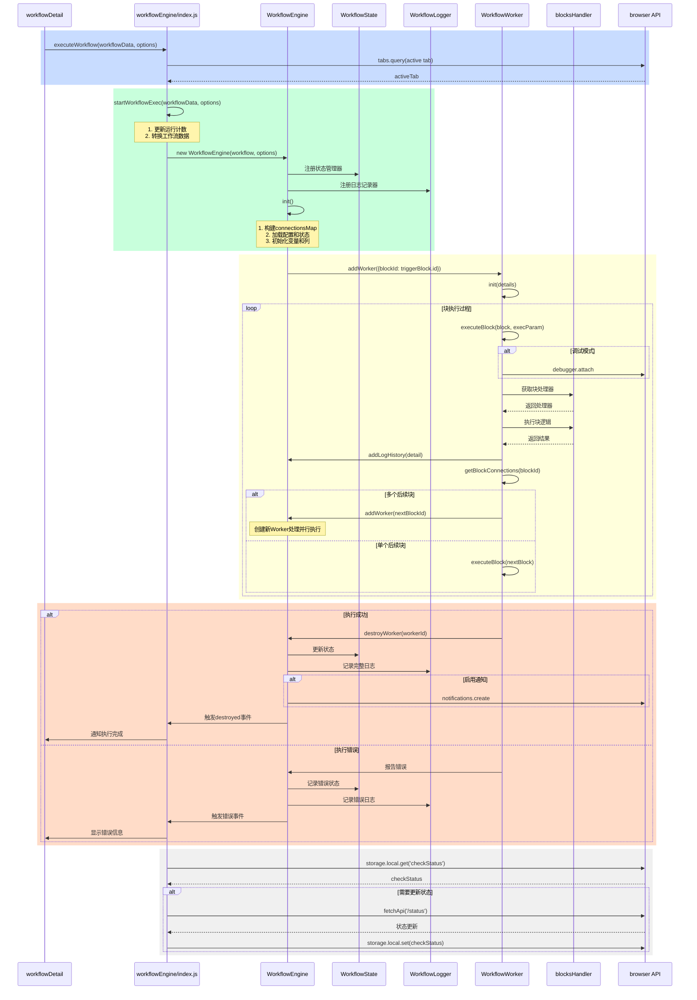

```mermaid
sequenceDiagram
    %% 颜色定义
    participant UI as workflowDetail #LightBlue
    participant Index as workflowEngine/index.js #LightGreen
    participant Engine as WorkflowEngine #LightGreen
    participant State as WorkflowState #Orange
    participant Logger as WorkflowLogger #Yellow
    participant Worker as WorkflowWorker #LightGreen
    participant Handler as blocksHandler #Pink
    participant Browser as browser API #Gray
    
    %% UI交互相关 - 蓝色
    rect rgb(200, 220, 255)
        UI->>Index: executeWorkflow(workflowData, options)
        Index->>Browser: tabs.query(active tab)
        Browser-->>Index: activeTab
    end
    
    %% 初始化相关 - 绿色
    rect rgb(200, 255, 220)
        Index->>Index: startWorkflowExec(workflowData, options)
        Note over Index: 1. 更新运行计数<br>2. 转换工作流数据
        
        Index->>Engine: new WorkflowEngine(workflow, options)
        Engine->>State: 注册状态管理器
        Engine->>Logger: 注册日志记录器
        
        Engine->>Engine: init()
        Note over Engine: 1. 构建connectionsMap<br>2. 加载配置和状态<br>3. 初始化变量和列
    end
    
    %% Worker执行相关 - 黄色
    rect rgb(255, 255, 220)
        Engine->>Worker: addWorker({blockId: triggerBlock.id})
        Worker->>Worker: init(details)
        
        loop 块执行过程
            Worker->>Worker: executeBlock(block, execParam)
            
            alt 调试模式
                Worker->>Browser: debugger.attach
            end
            
            Worker->>Handler: 获取块处理器
            Handler-->>Worker: 返回处理器
            
            Worker->>Handler: 执行块逻辑
            Handler-->>Worker: 返回结果
            
            Worker->>Engine: addLogHistory(detail)
            
            Worker->>Worker: getBlockConnections(blockId)
            
            alt 多个后续块
                Worker->>Engine: addWorker(nextBlockId)
                Note over Engine: 创建新Worker处理并行执行
            else 单个后续块
                Worker->>Worker: executeBlock(nextBlock)
            end
        end
    end
    
    %% 状态管理相关 - 橙色
    rect rgb(255, 220, 200)
        alt 执行成功
            Worker->>Engine: destroyWorker(workerId)
            Engine->>State: 更新状态
            Engine->>Logger: 记录完整日志
            
            alt 启用通知
                Engine->>Browser: notifications.create
            end
            
            Engine->>Index: 触发destroyed事件
            Index->>UI: 通知执行完成
            
        else 执行错误
            Worker->>Engine: 报告错误
            Engine->>State: 记录错误状态
            Engine->>Logger: 记录错误日志
            Engine->>Index: 触发错误事件
            Index->>UI: 显示错误信息
        end
    end
    
    %% 状态检查和清理 - 灰色
    rect rgb(240, 240, 240)
        Index->>Browser: storage.local.get('checkStatus')
        Browser-->>Index: checkStatus
        
        alt 需要更新状态
            Index->>Browser: fetchApi('/status')
            Browser-->>Index: 状态更新
            Index->>Browser: storage.local.set(checkStatus)
        end
    end
```
